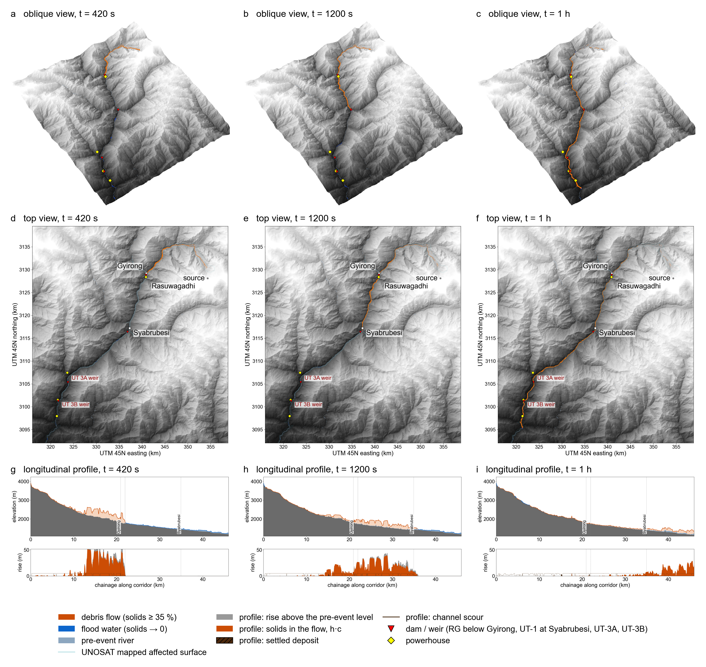

# Langtang 2026 rock–ice avalanche to 180-km flood: reconstruction code

[](https://doi.org/10.31223/X5250R)
[](https://doi.org/10.5281/zenodo.22549896)
[](https://doi.org/10.5281/zenodo.22549200)

**Preprint:** [Read on EarthArXiv](https://eartharxiv.org/repository/view/14849/) · **Code archive:** [10.5281/zenodo.22549896](https://doi.org/10.5281/zenodo.22549896) · **Revised videos:** [v2.0.0](https://doi.org/10.5281/zenodo.22566624) · **Original data:** [v1](https://doi.org/10.5281/zenodo.22549201)

**Topics:** rock-ice avalanche, debris flow, landslides, flood modelling, numerical simulation, Himalaya, Nepal, Langtang.

Code, run definitions and small registry files behind the paper
*A rock–ice avalanche without yield strength caused the 2026 Bhote Koshi–Trishuli flood, Nepal* (preprint)
(H. Park, Chungnam National University).

The repository holds everything needed to regenerate the simulations, the inversion grids, the figures and the
animations from the terrain and observation inputs. Large inputs (the corridor grids, the DEM, the disturbance and
elevation-change rasters, the stored run outputs and the rendered videos) are not in git; they are archived on Zenodo
(see *Data*).

## Figure 1 from the revised manuscript

[](docs/figures/fig1_corrected.png)

**Figure 1. The release crossing the gorge.** From the revised manuscript submitted to *Landslides*. The corrected 60 m corridor reconstruction is shown at 420, 1200 and 3600 s. Orange denotes solids-rich mixture and blue denotes diluted flood water. Flow depth is exaggerated fourfold in the oblique views and eightfold in the upper longitudinal profiles. Stage change in the lower profiles is shown at true scale. This is a model prediction, not an observed inundation map. Click the figure to open the full-resolution image.

## Watch the revised animations

[**Open the revised animation archive on Zenodo (v2.0.0)**](https://doi.org/10.5281/zenodo.22566624)

All six animations were regenerated from the corrected model on 7 September 2026 for the revised manuscript submitted to *Landslides*, *A rock-ice avalanche and the 2026 Bhote Koshi-Trishuli flood, Nepal*. They use source material added at rest and mass-conserving melting. These are model outputs, not event footage.

The upper videos show the 30 m reference calculation repeated with 5 s saved states over its first 24 minutes. Playback duration is approximately 25 seconds. Full-corridor plan and oblique views show the corrected 60 m two-dimensional model. The full-corridor profile uses the selected compound-section routing (`route_b2_w1`) below Syabrubesi. The maps and profile are distinct downstream model representations, as explained in the manuscript. Display exaggeration is marked in the videos.

Select a video below to open the MP4. Depending on your browser, the file will play or download. The intervals refer to saved simulation states, not playback duration.

| Area | View | Simulation interval | Video |
|---|---|---|---|
| Gorge | Oblique 3-D | 5 s | [Open MP4](https://zenodo.org/records/22566624/files/animation_gorge_oblique_5s.mp4) |
| Gorge | Plan view | 5 s | [Open MP4](https://zenodo.org/records/22566624/files/animation_gorge_top_5s.mp4) |
| Gorge | Longitudinal profile | 5 s | [Open MP4](https://zenodo.org/records/22566624/files/animation_gorge_profile_5s.mp4) |
| Full corridor | Oblique 3-D | 60 s | [Open MP4](https://zenodo.org/records/22566624/files/animation_full_corridor_oblique_60s.mp4) |
| Full corridor | Plan view | 60 s | [Open MP4](https://zenodo.org/records/22566624/files/animation_full_corridor_top_60s.mp4) |
| Full corridor | Longitudinal profile | 60 s | [Open MP4](https://zenodo.org/records/22566624/files/animation_full_corridor_profile_60s.mp4) |

The [all-version DOI](https://doi.org/10.5281/zenodo.22549200) resolves to the latest release. [Version 1](https://doi.org/10.5281/zenodo.22549201) preserves the original inputs, outputs and earlier animations as a historical archive. Those earlier videos do not represent the corrected model.

The [code archive](https://doi.org/10.5281/zenodo.22549896) and the reproduction instructions below describe the original reconstruction. This animation update does not update that separate code release. The revised animation archive includes supporting outputs and rendering scripts, with a README and file provenance.

## Layout

| path | content |
|---|---|
| `swe/solver_sparse.py` | mixture shallow-water solver on the corridor cells (PyTorch, GPU): HLL flux, hydrostatic reconstruction, concentration-dependent Coulomb + Manning resistance, ice and heat tracers, energy-conserving melting with rock/river/air heat terms, entrainment, settling, impact speed |
| `swe/solver_twophase.py` | two-phase (solid + fluid) version, Pitman–Le / Pudasaini closure, used for the phase-separation test |
| `swe/solver_swe.py` | dense-grid reference solver (same numerics; used for verification only) |
| `swe/preprocess_inputs.py`, `condition_valley.py`, `make_active.py`, `synth_channel.py`, `add_transects.py` | build the corridor grid inputs from the DEM, the UNOSAT detachment polygon, the route and the station registry |
| `swe/route1d.py` | one-dimensional Saint-Venant routing below Syabrubesi with the compound (channel + storage) section |
| `swe/sweep.py`, `sweep1d.py`, `holdout_routing.py` | corridor Latin-hypercube sweep, routing grids, hold-out fit of the storage section; `sweep.py` also holds the acceptance criteria (`CRITERIA`) and the station metrics |
| `swe/score_icef.py`, `score_volume.py`, `score_vf_grid.py`, `ice_mu_grid.py` | ice-fraction, volume and joint (volume × ice fraction) inversions from stored runs |
| `swe/force_history.py` | force on the Earth, −dP/dt, from 5-s frames |
| `swe/make_figures.py`, `make_upper_figures.py`, `plot_*.py`, `*_compare.py`, `valley_floor_width.py`, `trimline_profile.py`, `observed_footprint.py` | paper figures and tables, all from stored run outputs |
| `swe/render_animation.py`, `render_profile.py` | top-view / oblique 3-D and 1-D longitudinal-profile videos from stored frames |
| `sweep/*.json` | exact parameter sets of every sweep and grid reported in the paper |
| `inputs/*.json` | grid metadata and transect definitions of the three grids used (`corridor60s`, `corridor60n`, `upper30h`) |
| `data/` | station and observation registry, DHM stage records, route and centreline, UNOSAT detachment polygon, Geo-PERA sediment-budget tables |

Every script resolves the workspace root as `LANGTANG_ROOT` (environment variable) or the parent of `swe/`.
Run outputs go to `runs/<run-id>/` (`series.csv`, `result.json`, `frames/*.npz`, `final_state.npz`).

## Environment

Python 3.12, PyTorch 2.6 with CUDA, NumPy 2, pandas, SciPy, Matplotlib, imageio-ffmpeg. The preprocessing and the
figure scripts that read vector data also need geopandas, rasterio and shapely (`requirements-gis.txt`).
The 60-m corridor run of 8 hours takes 7 min on one 48-GB GPU; an hour on the 30-m grid takes 3 min.

```
pip install -r requirements.txt            # solver, inversion, figures, animations
pip install -r requirements-gis.txt        # preprocessing and the GIS-reading figure scripts
```

## Reproduction

1. **Inputs.** Place the Zenodo `inputs/` files (`corridor60s.npz`, `corridor60n.npz`, `upper30h.npz` and their `.json`)
   in `inputs/`. To rebuild them from the DEM instead:
   ```
   python swe/preprocess_inputs.py --cell 60 --tag corridor60h
   python swe/synth_channel.py --tag corridor60h --out-tag corridor60s      # hydraulic-geometry channel below Syabrubesi
   python swe/make_active.py --tag corridor60s
   python swe/preprocess_inputs.py --cell 30 --tag upper30h --bbox <see inputs/upper30h.json>
   python swe/make_active.py --tag upper30h
   python swe/smooth_pools.py --tag corridor60s              # pool-filled bed used for the animations (corridor60sp)
   ```
2. **River spin-up** (48 h at 60 m, 4 h at 30 m):
   ```
   python swe/solver_sparse.py --inputs inputs/corridor60s.npz --out runs/spinup60s_a --init-normal-depth --t-end 86400 --mu-s 0 --n-w 0.0208 --n-d 0.0145
   python swe/solver_sparse.py --inputs inputs/corridor60s.npz --out runs/spinup60s_c --restart runs/spinup60s_a/final_state.npz --t-end 86400 --mu-s 0 --n-w 0.0208 --n-d 0.0145
   python swe/solver_sparse.py --inputs inputs/upper30h.npz --out runs/u30h_spinup --init-normal-depth --t-end 14400 --mu-s 0 --n-w 0.0208 --n-d 0.0145
   ```
3. **Event run** (production parameters; the release is rock and ice with no free water, released over 30 s with the
   free-fall impact speed, the whole mechanical-energy loss delivered as heat, rock at 3 °C and 300 W/m² from the air):
   ```
   python swe/solver_sparse.py --inputs inputs/corridor60s.npz --out runs/prod60 --restart runs/spinup60s_c/final_state.npz \
     --release --release-c0 1.0 --release-duration 30 --release-speed 150 --release-ice-fraction 0.2 --release-volume-scale 1.0 \
     --melt-eff 1.0 --melt-energy --rock-temp-c 3 --q-air 300 --erosion-k 0.0074 --erosion-uc 6.0 --erodible-depth 5.0 \
     --mu-s 0 --n-w 0.0208 --n-d 0.0145 --dep-uc 1.833 --dep-tau 337 --t-end 28800 --frame-dt 60 --save-frames
   ```
   The same arguments on `inputs/upper30h.npz` with `--restart runs/u30h_spinup/final_state.npz --t-end 900 --frame-dt 5`
   give the 30-m force run. `sweep/jobs_*.json` list the arguments of every run of the (μ, n) grid, the ice-fraction
   sweep, the volume sweep and the joint (volume × ice fraction) grid.
4. **Routing below Syabrubesi** (compound section: bank 3 m, storage width 2 channel widths, 8-h spin):
   ```
   python swe/route1d.py --tag corridor60s --driver prod60 --out r1d_prod60 --n-w 0.03 --h-bank 3 --fp-scale 2 --spin 28800
   python swe/holdout_routing.py            # storage-parameter grid fitted on Galchhi and Devghat only
   ```
5. **Scoring and inversions** (stored runs only):
   ```
   python swe/sweep.py score --runs prod60
   python swe/score_icef.py ; python swe/score_volume.py ; python swe/score_vf_grid.py
   python swe/force_history.py --run force30 --tag upper30h
   ```
6. **Figures**: `python swe/make_figures.py`, `make_upper_figures.py`, `plot_grid_maps.py grid30e`, `plot_composition.py`,
   `plot_melt_history.py`, `plot_ice_fraction.py`, `plot_downstream_band.py`, `superelevation_compare.py`, `valley_floor_width.py`.
7. **Animations** (from the stored frames of a run; views `full`, `upper`; each rendered as top view and oblique 3-D):
   ```
   python swe/render_animation.py --run-id prod60 --base-run spinup60s_c --tag corridor60s --views full --display-dilate 4
   python swe/render_animation.py --run-id hires --base-run spinup60n --tag corridor60n --views upper --stride 1 --display-dilate 2
   python swe/render_profile.py --run-id prod60 --base-run spinup60s_c --tag corridor60s --smooth 5
   python swe/render_profile.py --run-id hires --base-run spinup60n --tag corridor60n --xmax 55 --smooth 5
   ```
   Videos and a `provenance.json` with SHA-256 sums are written to `figures/animations/<run-id>/`.

## Data

Observation sources: UNOSAT product 4260 (detachment zone, affected surface), DHM Nepal stage records, Planet
disturbance mapping, Geo-PERA elevation-change products, USGS/GFZ seismic origins and the EarthScope force inversion,
as cited in the paper. The Copernicus GLO-30 DSM and the derived corridor grids, together with the stored run outputs
used for every figure and the rendered videos, are archived on Zenodo: code doi:10.5281/zenodo.22549896, data and animations doi:10.5281/zenodo.22549201.

## Licence

MIT (code). Third-party observation files in `data/` keep the licences of their producers.
